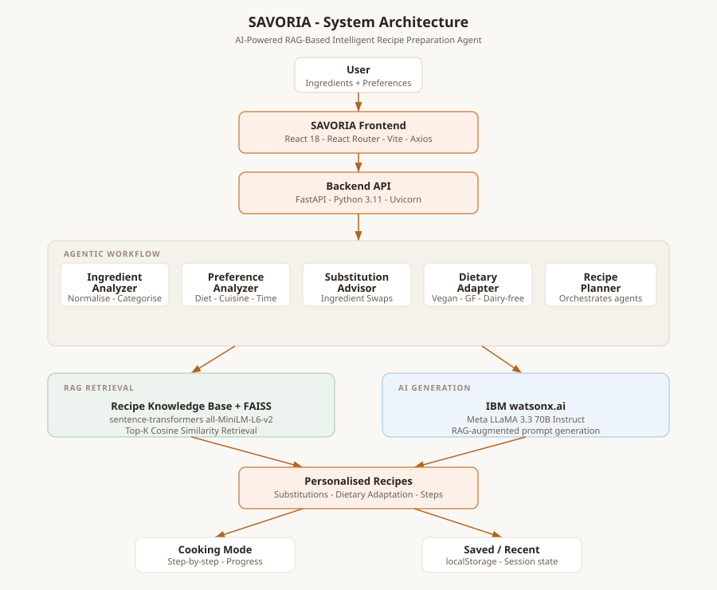

# SAVORIA

**SAVORIA: An AI-Powered RAG-Based Intelligent Recipe Preparation Agent for Personalised, Ingredient-Based Meal Preparation**

[](https://python.org)
[](https://fastapi.tiangolo.com)
[](https://react.dev)
[](https://www.ibm.com/products/watsonx-ai)

---

## Overview

SAVORIA is a full-stack intelligent recipe preparation platform that helps users prepare practical meals using the ingredients they already have. It combines **Retrieval-Augmented Generation (RAG)** with **IBM watsonx.ai** foundation models to retrieve relevant recipes and generate personalised meal suggestions adapted to available ingredients, dietary restrictions, preferences, and time constraints.

The system demonstrates a complete end-to-end agentic AI workflow: from ingredient analysis through vector-based recipe retrieval to personalised generation and step-by-step cooking guidance.

---

## Problem Statement

People frequently waste food because they cannot identify practical meals from what they already have. Generic recipe search requires knowing what to cook in advance and rarely adapts to available ingredients, dietary restrictions, or cooking constraints. The result is food waste, unnecessary grocery spending, and missed meal opportunities.

---

## Objectives

- Enable users to input available ingredients and receive personalised recipe suggestions
- Implement a practical RAG pipeline using FAISS vector retrieval over a curated recipe knowledge base
- Leverage IBM watsonx.ai for personalised recipe generation grounded in retrieved context
- Provide intelligent ingredient substitutions and dietary adaptations
- Support reduction of food waste by maximising use of available pantry items
- Deliver a professional, accessible frontend experience with step-by-step cooking guidance

---

## Key Features

| Feature | Description |
|---------|-------------|
| **Ingredient-Based Search** | Enter available ingredients; SAVORIA generates matching recipes |
| **RAG Retrieval** | FAISS cosine-similarity search over embedded recipe knowledge base |
| **IBM watsonx.ai Generation** | Personalised recipe generation via Meta LLaMA 3.3 70B Instruct |
| **Dietary Adaptation** | Vegetarian, vegan, gluten-free, dairy-free, high-protein, low-carb, low-spice |
| **Ingredient Substitutions** | Practical alternatives when ingredients are unavailable |
| **Food Waste Reduction** | Highlights used and leftover ingredients with suggestions |
| **Cooking Mode** | Focused step-by-step interface with progress tracking and keyboard navigation |
| **Recipe Management** | Save and revisit favourite and recent recipes via local storage |
| **Filtering & Sorting** | Filter by dietary requirement, meal type; sort by match score, time, difficulty |

---

## System Architecture

```
User
 │
 ▼
SAVORIA Frontend (React 18 · React Router · Vite · Axios)
 │
 ▼
Backend API (FastAPI · Python 3.11 · Uvicorn)
 │
 ├── Ingredient Analyzer  ──► Normalise, deduplicate, categorise ingredients
 ├── Preference Analyzer  ──► Validate dietary, cuisine, time, servings
 ├── Substitution Advisor ──► Curated ingredient substitution knowledge base
 ├── Dietary Adapter      ──► Adaptation rules per dietary requirement
 └── Recipe Planner       ──► Central agentic orchestrator
          │
          ├──► RAG RETRIEVAL
          │     ├── Recipe Knowledge Base (20 curated recipes in JSON)
          │     ├── sentence-transformers (all-MiniLM-L6-v2) embeddings
          │     └── FAISS IndexFlatIP cosine-similarity Top-K retrieval
          │
          └──► AI GENERATION
                ├── RAG context assembly (retrieved recipes + substitutions + dietary rules)
                ├── IBM watsonx.ai (Meta LLaMA 3.3 70B Instruct)
                └── Structured JSON recipe output
                         │
                         ▼
               Personalised Recipes
               (Ingredients · Substitutions · Steps · Waste Reduction · Nutrition)
                    │                │
                    ▼                ▼
             Cooking Mode      Saved / Recent
             (step-by-step)   (localStorage)
```

See [`docs/architecture.svg`](docs/architecture.svg) for the visual architecture diagram.

---

## Application Workflow

1. **User opens SAVORIA** and navigates to the Create Recipe page
2. **Enters available ingredients** (e.g. garlic, chicken, tomato, ginger)
3. **Sets preferences** — dietary requirement, cuisine, meal type, cooking time, servings
4. **Submits request** → backend processes through the agentic workflow
5. **Recipe Suggestions page** shows 3 personalised recipes with match scores
6. **Selects a recipe** → Recipe Detail shows ingredients (marked available/missing), steps, substitutions, tips, nutrition, food waste analysis
7. **Starts Cooking Mode** → focused step-by-step interface with keyboard navigation
8. **Saves recipe** → accessible from Saved Recipes page via local storage

---

## Agentic AI Workflow

SAVORIA implements a modular agentic pipeline with the following components:

| Agent/Module | Responsibility |
|---|---|
| `IngredientAnalyzer` | Normalise, deduplicate, categorise, validate ingredient input |
| `PreferenceAnalyzer` | Validate and normalise dietary preferences, cuisine, meal type, time |
| `RecipeRAG` | FAISS vector index build, load, and retrieval |
| `SubstitutionAdvisor` | Curated substitution knowledge base with availability prioritisation |
| `DietaryAdapter` | Dietary adaptation rules, compatibility checking, prompt instructions |
| `RecipeGenerator` | IBM watsonx.ai prompt construction, API call, JSON parsing, RAG fallback |
| `RecipePlanner` | Central orchestrator — coordinates all agents, builds API response |

---

## RAG Pipeline

### Knowledge Base
- 20 curated recipes in `backend/data/recipes.json`
- Covers: Italian, Indian, Mexican, Asian, Japanese, Mediterranean, Middle Eastern, French, Greek, Contemporary cuisines
- Meal types: breakfast, lunch, dinner, snack
- Dietary categories: vegetarian, vegan, gluten-free, dairy-free, high-protein
- Each recipe includes: ingredients with quantities, step-by-step instructions, substitutions, cooking tips, nutritional information

### Retrieval Process
1. Each recipe is converted to a rich text document (name + description + ingredients + cuisine + dietary info + tags + steps)
2. Documents are embedded using `sentence-transformers/all-MiniLM-L6-v2` (384-dimensional vectors)
3. Embeddings are normalised and stored in a **FAISS IndexFlatIP** (inner product = cosine similarity for normalised vectors)
4. User query is constructed from available ingredients + preferences and embedded
5. Top-K candidates are retrieved by cosine similarity
6. Results are re-ranked by a combined score (50% semantic similarity + 50% ingredient match ratio)
7. Hard filters applied: cooking time, dietary preference

### Generation
Retrieved recipes + substitution guidance + dietary adaptation rules are assembled into a structured prompt sent to **IBM watsonx.ai** (Meta LLaMA 3.3 70B Instruct). The model generates 3 personalised recipes as structured JSON.

If watsonx.ai is unavailable or not configured, the system gracefully falls back to serving the RAG-retrieved recipes directly.

---

## Technology Stack

| Layer | Technology |
|---|---|
| Frontend | React 18, React Router v6, Vite, Axios, CSS Custom Properties |
| Backend | Python 3.11+, FastAPI, Pydantic v2, Uvicorn, HTTPx |
| RAG | FAISS (`faiss-cpu`), sentence-transformers (`all-MiniLM-L6-v2`), NumPy |
| AI Generation | IBM watsonx.ai, Meta LLaMA 3.3 70B Instruct |
| Storage | Browser `localStorage`, JSON flat-file knowledge base, FAISS binary index |
| Testing | pytest, pytest-asyncio, FastAPI TestClient |

---

## Project Structure

```
SAVORIA/
├── backend/
│   ├── app/
│   │   ├── agents/
│   │   │   ├── ingredient_analyzer.py   # Normalise and categorise ingredients
│   │   │   ├── preference_analyzer.py   # Validate dietary/cuisine/time preferences
│   │   │   ├── substitution_advisor.py  # Ingredient substitution knowledge base
│   │   │   ├── dietary_adapter.py       # Dietary adaptation rules and prompts
│   │   │   ├── recipe_generator.py      # watsonx.ai prompt construction + generation
│   │   │   └── recipe_planner.py        # Central agentic orchestrator
│   │   ├── api/
│   │   │   └── routes.py                # FastAPI route handlers
│   │   ├── models/
│   │   │   └── schemas.py               # Pydantic request/response models
│   │   ├── rag/
│   │   │   └── retriever.py             # FAISS RAG pipeline
│   │   ├── utils/
│   │   │   └── watsonx_client.py        # IBM watsonx.ai API client
│   │   ├── config.py                    # Settings from environment variables
│   │   └── main.py                      # FastAPI application entry point
│   ├── data/
│   │   └── recipes.json                 # Recipe knowledge base (20 recipes)
│   ├── tests/
│   │   └── test_savoria.py              # Comprehensive test suite
│   ├── .env.example                     # Environment variable template
│   ├── requirements.txt                 # Python dependencies
│   └── pytest.ini                       # Test configuration
├── frontend/
│   ├── src/
│   │   ├── components/
│   │   │   ├── Navbar.jsx               # Navigation header
│   │   │   └── RecipeCard.jsx           # Recipe card component
│   │   ├── pages/
│   │   │   ├── Home.jsx                 # Landing page
│   │   │   ├── CreateRecipe.jsx         # Ingredient + preference input
│   │   │   ├── Suggestions.jsx          # Recipe suggestions list
│   │   │   ├── RecipeDetail.jsx         # Full recipe detail with tabs
│   │   │   ├── CookingMode.jsx          # Step-by-step cooking interface
│   │   │   ├── SavedRecipes.jsx         # Saved and recent recipes
│   │   │   └── About.jsx                # About, architecture, tech stack
│   │   ├── utils/
│   │   │   ├── api.js                   # Axios API client
│   │   │   └── storage.js               # localStorage utilities
│   │   ├── styles/
│   │   │   └── globals.css              # Global CSS design system
│   │   ├── App.jsx                      # React router setup
│   │   └── main.jsx                     # React entry point
│   ├── package.json
│   ├── vite.config.js
│   └── index.html
├── docs/
│   ├── architecture.svg                 # System architecture diagram
│   └── generate_architecture.py        # Diagram generation script
├── .gitignore
└── README.md
```

---

## IBM watsonx.ai Integration

SAVORIA integrates IBM watsonx.ai via the REST API with IAM token authentication:

- **Endpoint**: `https://eu-gb.ml.cloud.ibm.com/ml/v1/text/chat`
- **Authentication**: IBM API Key → IAM token exchange (`iam.cloud.ibm.com/identity/token`)
- **Model**: `meta-llama/llama-3-3-70b-instruct` (configurable via `IBM_MODEL_ID`)
- **Integration file**: `backend/app/utils/watsonx_client.py`

The model integration is modular — changing the foundation model requires only updating `IBM_MODEL_ID` in the `.env` file.

---

## Configuration

### Environment Variables

```bash
# IBM watsonx.ai (required for AI generation)
IBM_API_KEY=your_ibm_api_key_here
IBM_PROJECT_ID=your_ibm_project_id_here
IBM_MODEL_ID=meta-llama/llama-3-3-70b-instruct
IBM_WATSONX_URL=https://eu-gb.ml.cloud.ibm.com

# Application
DEBUG=false
APP_NAME=SAVORIA
APP_VERSION=1.0.0

# RAG settings
TOP_K_RETRIEVAL=5
EMBEDDING_MODEL=all-MiniLM-L6-v2

# Generation
MAX_TOKENS=2000
TEMPERATURE=0.3
```

**Security**: Credentials must **never** be committed to source control. The `.env` file is listed in `.gitignore`. Use `.env.example` as the template.

---

## Installation

### Prerequisites

- Python 3.11+
- Node.js 18+ and npm
- Internet connection (for sentence-transformer model download on first run; ~90MB)

### Backend Setup

```bash
cd backend

# Copy and fill environment variables
cp .env.example .env
# Edit .env with your IBM watsonx.ai credentials

# Create virtual environment (recommended)
python -m venv venv
venv\Scripts\activate        # Windows
# source venv/bin/activate   # macOS/Linux

# Install dependencies
pip install -r requirements.txt
```

### Frontend Setup

```bash
cd frontend

# Install dependencies
npm install
```

---

## Running the Application

### Start the Backend

```bash
cd backend
uvicorn app.main:app --reload --port 8000
```

The API will be available at:
- **API**: http://localhost:8000
- **Interactive docs**: http://localhost:8000/docs
- **Health check**: http://localhost:8000/api/health

### Start the Frontend

```bash
cd frontend
npm run dev
```

The application will be available at **http://localhost:3000**

---

## Usage

1. Open http://localhost:3000
2. Click **Create Recipe** or **Get Started**
3. Enter your available ingredients (e.g. `garlic`, `pasta`, `olive oil`, `tomato`)
4. Optionally: list ingredients to avoid, select dietary preference, cuisine, meal type, cooking time, servings
5. Click **Find My Recipes**
6. Browse the personalised recipe suggestions
7. Click a recipe to view full details (ingredients, steps, substitutions, tips, nutrition)
8. Click **Start Cooking** for the step-by-step cooking mode
9. Save recipes with the heart icon for later

---

## Testing

### Run Unit and Integration Tests

```bash
cd backend

# Run all non-RAG unit tests
pytest tests/test_savoria.py::TestIngredientAnalyzer \
       tests/test_savoria.py::TestPreferenceAnalyzer \
       tests/test_savoria.py::TestSubstitutionAdvisor \
       tests/test_savoria.py::TestDietaryAdapter \
       tests/test_savoria.py::TestWatsonxClient -v

# Run full pipeline tests (requires model download ~90MB on first run)
pytest tests/test_savoria.py -v
```

### Quick Validation Scripts

```bash
cd backend

# Validate all modules
python validate_modules.py

# Validate API endpoints
python validate_api.py

# Validate full pipeline
python validate_full_pipeline.py
```

---

## Example Workflow

```
User Input:
  Available ingredients: garlic, chicken breast, onion, ginger, tomato, cumin, oil
  Dietary: none
  Meal type: dinner
  Servings: 2

↓ IngredientAnalyzer normalises → ['garlic', 'chicken breast', 'onion', 'ginger', 'tomato', 'cumin', 'oil']
↓ PreferenceAnalyzer → {meal_type: 'dinner', servings: 2}
↓ RecipeRAG retrieves → top 5 semantically similar recipes from knowledge base
↓ RecipeGenerator builds prompt with RAG context
↓ IBM watsonx.ai generates 3 personalised recipes (JSON)

Recipe Suggestions:
1. Creamy Butter Chicken         — 6/10 ingredients available, 35 min, Medium
2. Chicken Stir-Fry              — 5/10 ingredients available, 20 min, Medium
3. Quick Garlic Chicken          — 7/8 ingredients available, 25 min, Easy

User selects Recipe 1:
  - Sees all 14 ingredients with available/missing flags
  - Reads substitution: "heavy cream → coconut cream (dairy-free)"
  - Views food waste: 5 of 7 ingredients used; tomato and oil can be used in salads
  - Clicks "Start Cooking" → step-by-step cooking mode
```

---

## Limitations

- The recipe knowledge base contains 20 curated recipes; highly unusual ingredient combinations may produce less optimal RAG retrieval
- The first run requires downloading the sentence-transformer model (~90MB) from Hugging Face
- AI generation response time depends on IBM watsonx.ai API latency (typically 10–30 seconds)
- The RAG fallback provides accurate results from the knowledge base when watsonx.ai is unavailable
- Node.js is required for the React frontend; the backend API is fully independent and testable without it

---

## Future Scope

- Expand recipe knowledge base (100+ recipes, user-contributed)
- Add nutritional tracking and meal planning across a week
- Implement image-based ingredient recognition
- Add voice-guided cooking mode
- Multi-language support
- Community recipe sharing and rating
- Integration with grocery delivery APIs for missing ingredients

---

## Security Notes

- IBM API credentials are loaded **exclusively from environment variables** via `.env` file
- The `.env` file is explicitly listed in `.gitignore` and must never be committed
- Use `.env.example` as the credential template for collaborators
- No credentials appear in frontend code, source files, README examples, or screenshots
- The `WatsonxClient` uses short-lived IAM bearer tokens obtained at request time

---

## Architecture Diagram



---

*SAVORIA — Built with React, FastAPI, FAISS, and IBM watsonx.ai*
